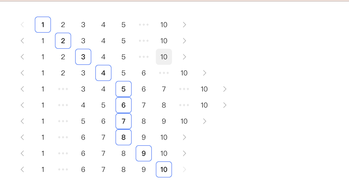

# `[P12-s1]` Pagination 分页组件-基础版

## 项目阶段简介

### 项目阶段介绍

按照设计稿和组件说明，实现基础版的 Pagination 分页组件。

基础版的 Pagination 分页组件可以通过参数正确初始化组件，实现分页组件的所有交互功能。

### 组件说明

- 分页器基础样式实现
- 通过 `total` 和 `pageSize` 参数控制分页数量
- 在分页数非常多时，支持省略中间的页码
- 支持默认页码
- 支持左右箭头切换分页
- 支持点击页码切换分页

### 设计稿说明

- 页面中有 10 个分页器，它们所有的参数都一样，除了 **默认页码** 不一样，从上往下，分页器的默认页码参数从 1 到 10。
- 通过这种方式来给你展示分页器组件在页数非常多的时候，是如何省略中间的页码的，它的规律是：
  - 第 1 个页码和最后 1 个页码一定会展示。
  - 当前页码旁边至少要展示 r 个页码，这个 r 你可以是实现成变量，也可以默认写死为 2。
  - 正常来说，两边都会出现省略，但是当某一边没有出现省略时（也就是当前页面靠近某一边时），这一边的页码至少要展示 2r + 1 个页码。

- 当前页码边框高亮。
- 点击最左边箭头时，页码 - 1。
- 点击最右边箭头时，页码 + 1。
- 当前页码为 1 时，左箭头置灰，不可点击。
- 当前页码为最大页码时，右箭头置灰，不可点击。
- 点击某个页码时，可以切换到该页码。

> [在线体验](https://zhidaofe.github.io/P12-pagination-component/s1/index.html)

### 项目要求

- 先按照设计稿和组件说明，实现组件代码。然后在页面中使用你实现的组件来达到题目要求
- 保证最终实现的页面完全复现设计稿，真实的工作中，火眼金睛的设计师 1 px 的差异都能找到，不要心存侥幸
- **先按照设计稿和组件说明真得去开发，不要看参考答案！**，也不要去看业界和开源的组件库代码
- 如果开发过程中碰到问题，不知道怎么实现的话，去网上查找答案，不要去看答案！在真实的工作中，你不会有参考答案的，你只能自己想办法找到问题的解决方案
- 记录你的疑问，比如：
  - 有个很难实现的地方，总感觉自己实现的方案不是最优方案，还有更好的方案
  - 不知道自己的实现方案到底好不好
  - 完成开发之后，再整体 review 一遍自己的代码，觉得还有哪些地方是不够好的
- 带着你的疑问，再去查看参考答案或者开源组件库去寻找答案，如果还是没有得到解答，请来 [**之道前端**](https://kcnrozgf41zs.feishu.cn/wiki/PBj0w5rjUiEWVgktZE0caKOunNc) 提问

### 练习本项目你会收获什么？

- 提升原生 JavaScript 的编码熟练度
- 学会正确使用原生 JavaScript 处理 Dom
- 学会正确使用原生 JavaScript 处理 DOM 事件
- 学会正确使用原生 JavaScript 更新 Dom 结构
- 学会如何封装一个组件
- 【进阶】深刻理解什么是好的组件
- 【进阶】感受原生 JavaScript 更新 Dom 结构的问题
- 【进阶】积累封装组件的经验
- 【进阶】逐渐形成自己的 JavaScript 代码风格

> 如果只实践一次，那就只会有基础收获
>
> 只有不断练习、思考、优化，才会有进阶收获

### 本项目适合的同学

- 处于 L2 水平的同学
- 对原生 JavaScript 还不熟练的同学
- 没怎么封装过 UI 组件的同学
- 没怎么写过 C 端页面，大部分时间在做 admin 系统的同学
- 只会开发 React/Vue 组件，想要练习如何封装原生 JavaScript 组件的同学

## 开始练习

我们针对不同经验的同学提供了相应的[练习指引手册](https://kcnrozgf41zs.feishu.cn/wiki/An7GwvUQrirdvdkJdQ9c4q3Rndd)，你可以按照这个指引手册来练习本项目。

