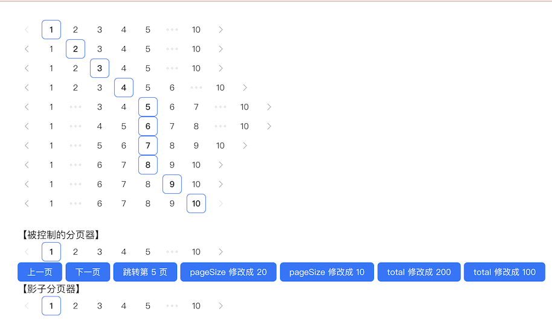

# `[P12-s2]` Pagination 分页组件-增强版

## 项目阶段简介

### 项目阶段介绍

按照设计稿和组件说明，扩展基础版 Pagination 分页组件，实现增强版的 Pagination 分页组件。

基础版的 Pagination 分页组件已经实现了分页器的所有交互功能。

接下来增强版的 Pagination 分页组件主要是扩展分页组件的对外接口方法，

让页面或者其他组件可以通过这些接口方法来控制分页组件。

### 组件说明

- 支持 onChange 回调
- 支持调用方直接切换分页
- 支持调用方动态修改 pageSize
- 支持调用方动态修改 total

### 设计稿说明

- 上面的 10 个分页器跟 s1 的一样，因为 s2 是在 s1 的基础上扩展而来的。
- 接下来是一个【被控制的分页器】，这个分页器下面有一排按钮，从左往右依次为：
  - 上一页：点击按钮之后，上面的分页器切换到上一页。
  - 下一页：点击按钮之后，上面的分页器切换到下一页。
  - 跳转第 5 页：点击按钮之后，上面的分页器切换到第 5 页。
  - pageSize 修改成 20：点击按钮之后，上面的分页器的每页数量参数被调整为 20。
  - pageSize 修改成 10：点击按钮之后，上面的分页器的每页数量参数被调整为 10。
  - total 修改成 200：点击按钮之后，上面的分页器的总数参数被调整为 200。
  - total 修改成 100：点击按钮之后，上面的分页器的总数参数被调整为 100。
- 最后是一个【影子分页器】，这个分页器会跟随上面【被控制的分页器】切换分页，当【被控制的分页器】的页码发生变化时，【影子分页器】也会切换到对应的页码。

> [在线体验](https://zhidaofe.github.io/P12-pagination-component/s2/index.html)

### 项目要求

- 增强版是要在基础版的 Pagination 分页组件上进行扩展的，因此把你的 s1 答案 copy 过来之后，再进行 s2 的练习
- 先按照设计稿和组件说明，实现组件代码。然后在页面中使用你实现的组件来达到题目要求
- **先按照设计稿和组件说明真得去开发，不要看参考答案！**，也不要去看业界和开源的组件库代码
- 如果开发过程中碰到问题，不知道怎么实现的话，去网上查找答案，不要去看答案！在真实的工作中，你不会有参考答案的，你只能自己想办法找到问题的解决方案
- 记录你的疑问，比如：
  - 有个很难实现的地方，总感觉自己实现的方案不是最优方案，还有更好的方案
  - 不知道自己的实现方案到底好不好
  - 完成开发之后，再整体 review 一遍自己的代码，觉得还有哪些地方是不够好的
- 带着你的疑问，再去查看参考答案或者开源组件库去寻找答案，如果还是没有得到解答，请来 [**之道前端**](https://kcnrozgf41zs.feishu.cn/wiki/PBj0w5rjUiEWVgktZE0caKOunNc) 提问

### 练习本项目你会收获什么？

- 提升原生 JavaScript 的编码熟练度
- 学会如何封装一个组件
- 练习如何设计组件的对方方法
- 【进阶】深刻理解什么是好的组件
- 【进阶】积累封装组件的经验
- 【进阶】深刻理解如何控制一个被封装的组件，以及组件之间的联动是怎样的
- 【进阶】逐渐形成自己的 JavaScript 代码风格

> 如果只实践一次，那就只会有基础收获
>
> 只有不断练习、思考、优化，才会有进阶收获

### 本项目适合的同学

- 处于 L2 水平的同学
- 对原生 JavaScript 还不熟练的同学
- 没怎么封装过 UI 组件的同学
- 没怎么写过 C 端页面，大部分时间在做 admin 系统的同学
- 只会开发 React/Vue 组件，想要练习如何封装原生 JavaScript 组件的同学

## 开始练习

我们针对不同经验的同学提供了相应的[练习指引手册](https://kcnrozgf41zs.feishu.cn/wiki/An7GwvUQrirdvdkJdQ9c4q3Rndd)，你可以按照这个指引手册来练习本项目。

